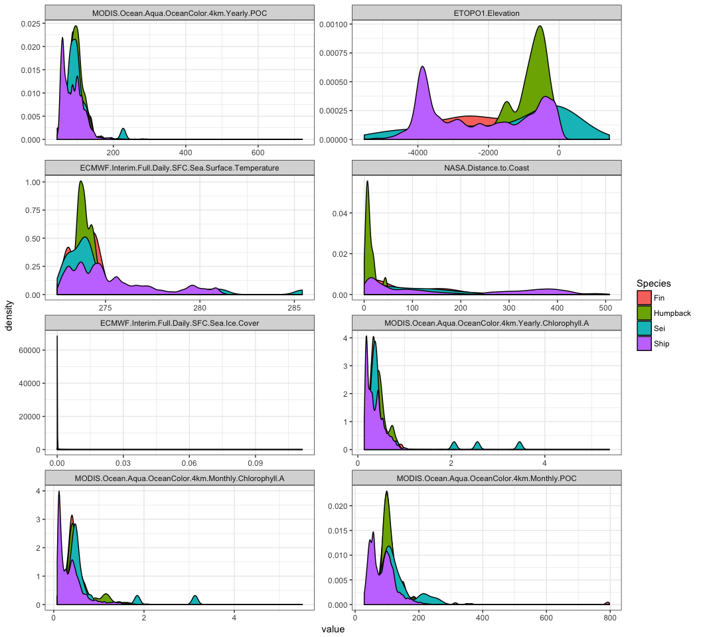
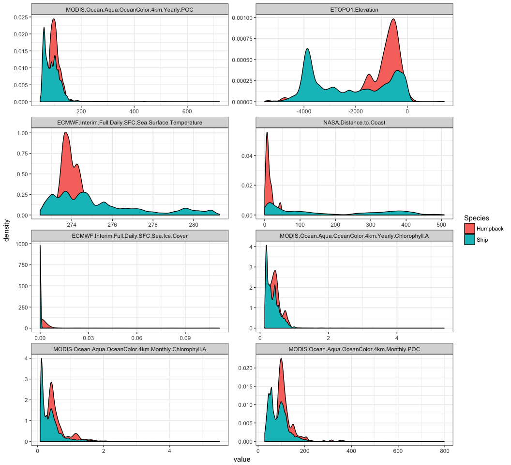
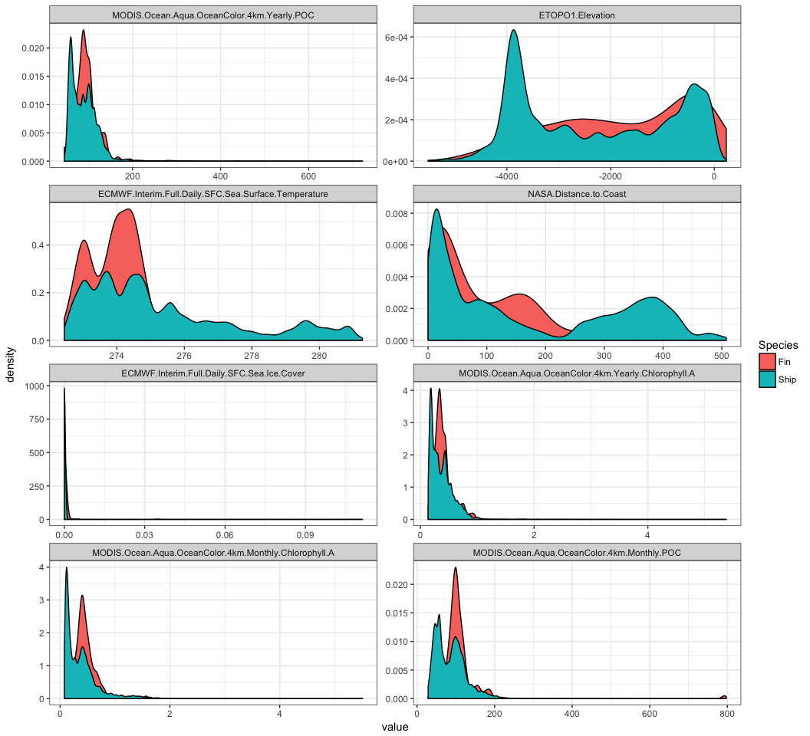
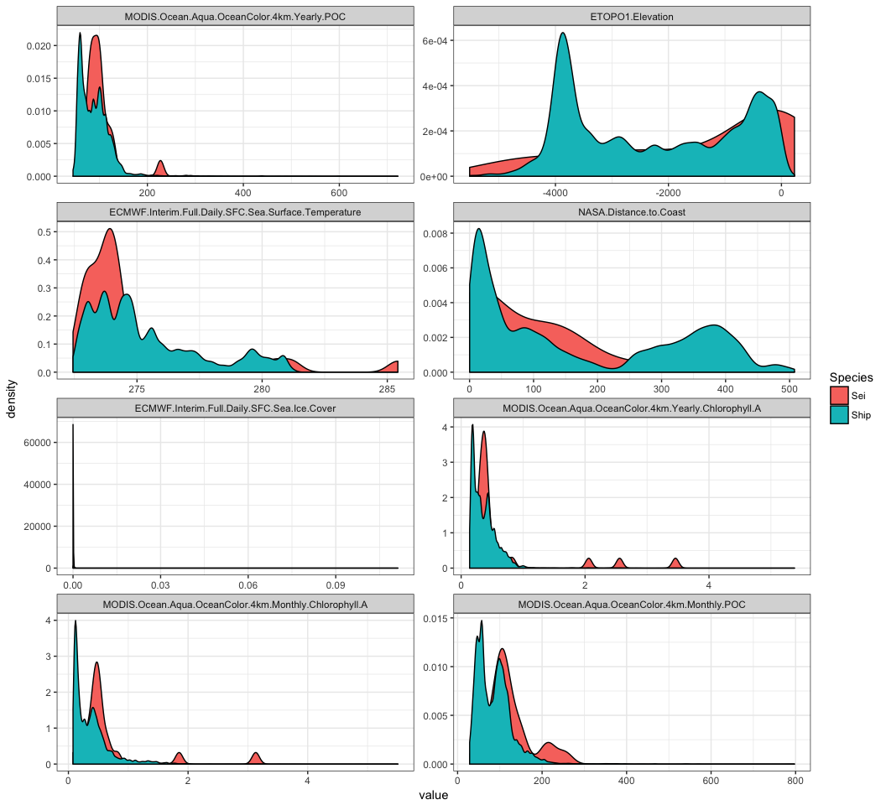

# ArgentinaWhales


What percentage of the data has MODIS coverage?


```
## # A tibble: 8 x 2
##                                                     Env coverage
##                                                  <fctr>    <dbl>
## 1                                      ETOPO1.Elevation    1.000
## 2                                NASA.Distance.to.Coast    1.000
## 3  MODIS.Ocean.Aqua.OceanColor.4km.Yearly.Chlorophyll.A    0.888
## 4            MODIS.Ocean.Aqua.OceanColor.4km.Yearly.POC    0.887
## 5  ECMWF.Interim.Full.Daily.SFC.Sea.Surface.Temperature    0.876
## 6            ECMWF.Interim.Full.Daily.SFC.Sea.Ice.Cover    0.876
## 7           MODIS.Ocean.Aqua.OceanColor.4km.Monthly.POC    0.697
## 8 MODIS.Ocean.Aqua.OceanColor.4km.Monthly.Chlorophyll.A    0.690
```

```
## # A tibble: 32 x 3
## # Groups:   Species [4]
##     Species                                                  Env coverage
##      <fctr>                                               <fctr>    <dbl>
##  1      Fin                                     ETOPO1.Elevation        1
##  2      Fin ECMWF.Interim.Full.Daily.SFC.Sea.Surface.Temperature        1
##  3      Fin                               NASA.Distance.to.Coast        1
##  4      Fin           ECMWF.Interim.Full.Daily.SFC.Sea.Ice.Cover        1
##  5 Humpback                                     ETOPO1.Elevation        1
##  6 Humpback                               NASA.Distance.to.Coast        1
##  7      Sei                                     ETOPO1.Elevation        1
##  8      Sei                               NASA.Distance.to.Coast        1
##  9     Ship                                     ETOPO1.Elevation        1
## 10     Ship                               NASA.Distance.to.Coast        1
## # ... with 22 more rows
```

Let's see if we can get better estimates of SST somewhere, hard to know if this is important variable in polar environments.

# Used versus Sampled Space

```
## Warning: Removed 406864 rows containing non-finite values (stat_density).
```

<!-- -->

```
## Warning: Removed 406864 rows containing non-finite values (stat_density).
```

```
## Warning: Removed 406644 rows containing non-finite values (stat_density).
```

<!-- -->

```
## Warning: Removed 406644 rows containing non-finite values (stat_density).
```

```
## Warning: Removed 405881 rows containing non-finite values (stat_density).
```

<!-- -->

```
## Warning: Removed 405881 rows containing non-finite values (stat_density).
```

```
## Warning: Removed 405819 rows containing non-finite values (stat_density).
```

<!-- -->

```
## Warning: Removed 405819 rows containing non-finite values (stat_density).
```
